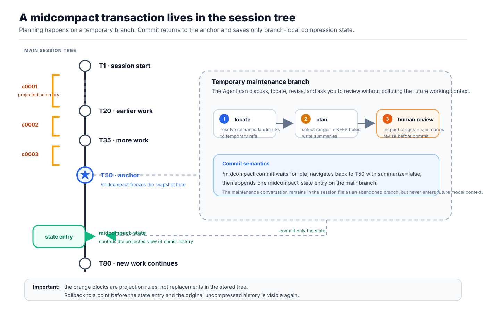
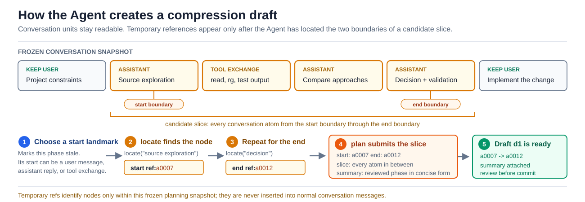
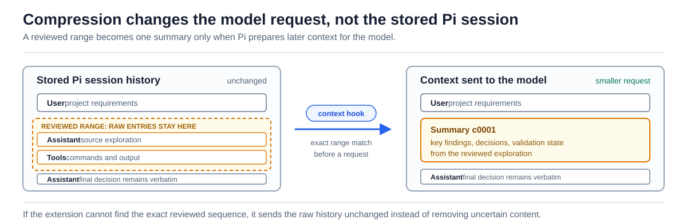

# pi-midcompact

**Compress stale parts of a long Pi session without deleting the original history.**

Long-running work accumulates exploration, command output, rejected approaches, and completed phases. `pi-midcompact` lets you and the Agent replace only the parts you have reviewed with concise summaries, leaving the current task and important decisions in full context.

- Choose exactly which conversation ranges to compress.
- Review the proposed boundaries and summaries before anything changes.
- Keep the original Pi session entries available for later recall.
- Keep compression local to the current session-tree branch.

## Install

From npm:

```bash
pi install npm:pi-midcompact
```

From GitHub:

```bash
pi install git:github.com/frostime/pi-midcompact
```

Restart Pi or run `/reload` after installation. The extension is built for Pi `0.84.x`.

## Use It

Start a transaction at a natural breakpoint: the current work is complete enough to summarize, and Pi is idle. The current point becomes a frozen **anchor**. The Agent plans against that snapshot, so later planning discussion cannot accidentally become part of the compressed working context.

### 1. Set the compression checkpoint

Run:

```text
/midcompact start
```

Pi asks for confirmation, then creates a temporary transaction after the anchor and tells the Agent how to plan the compression. No conversation is changed yet. You can include the initial scope in the same command:

```text
/midcompact start Compress the early repository exploration, but keep user requirements verbatim.
```

### 2. Discuss what to compress with the Agent

Describe the goal in normal language. For example:

```text
Compress the early repository exploration and routine command output.
Keep the user's requirements, the rejected database decision, and the final validation errors verbatim.
Aim for a moderate reduction, not the smallest possible context.
```

The Agent locates relevant parts of the frozen conversation, proposes one or more ranges, and writes a summary for each range. You can ask it to preserve a specific message, split a range, or revise a summary.

### 3. Review the proposal

Run:

```text
/midcompact review
```

The native TUI displays the frozen conversation as a linear timeline. Each item is marked either `KEEP` or as belonging to a proposed range. Review the range boundaries and the summary that will replace each range.

You can edit a selected summary or topic in the TUI. To change range boundaries or leave an important hole uncompressed, tell the Agent what to keep and ask it to revise the plan, then review it again.

### 4. Commit the reviewed compression

When the plan is correct, run:

```text
/midcompact commit
```

This is deliberately a human command. The Agent cannot commit compression itself.

Pi returns to the anchor, discards the temporary planning branch, stores the reviewed compression state, and resumes work from the committed branch. Future model requests receive the selected old ranges as summaries instead of raw messages.



### 5. Continue working or abort

Keep working normally after committing. If you decide not to compress, run:

```text
/midcompact abort
```

This returns to the anchor and discards the transaction without changing the active context.

## What the Agent Does

During an active transaction, the Agent uses the `midcompact` tool against the frozen anchor snapshot:



| Action | Purpose |
| --- | --- |
| `locate` | Finds likely conversation landmarks and shows readable previews. |
| `plan` | Adds, revises, removes, or displays proposed compression ranges and summaries. |
| `recall` | Searches committed summaries or temporarily retrieves original content from a compressed block. |

The Agent makes semantic decisions: which exploration is stale, which user requirements and decisions must stay visible, and what a useful summary needs to retain. The extension enforces the mechanical rules: ranges cannot overlap, incomplete tool exchanges cannot be compressed, and the Agent cannot bypass the human commit gate.

Temporary references such as `a0007` exist only during planning. They are not inserted into normal prompts or retained as permanent message identifiers.

## What Happens Behind the Scenes

A committed compression does not rewrite or delete the Pi session.



1. `/midcompact start [instructions]` freezes the current session-tree leaf as the anchor and starts a temporary maintenance branch.
2. The Agent and you discuss a draft on that branch. This planning chatter is abandoned at commit.
3. `/midcompact commit` returns to the anchor and saves a branch-local `midcompact-state` entry containing the reviewed ranges and summaries.
4. Before later model requests, the extension finds the exact selected raw message sequences and projects them into summary messages.
5. The underlying session entries remain unchanged. If an exact match cannot be found, the extension keeps the raw messages rather than removing uncertain content.

This is why the process is both selective and reversible at the information-access level: a summary saves context, while the source history remains available through recall or the Pi session tree.

## Review Controls

Inside `/midcompact review`:

```text
n/p or Left/Right  select a proposed range
Up/Down, j/k       scroll
PgUp/PgDn          page
x                  expand the selected range's atoms
e                  edit the selected summary
t                  edit the selected topic
d                  remove the selected range
Enter/Esc/q        close
```

## Commands

| Command | Result |
| --- | --- |
| `/midcompact start [instructions]` | Confirms and starts a transaction at the current session-tree leaf, optionally with an initial compression focus. |
| `/midcompact review` | Opens the draft review timeline. |
| `/midcompact commit` | Commits the reviewed draft. Human only. |
| `/midcompact abort` | Abandons the transaction and returns to the anchor. |
| `/midcompact status` | Displays the current draft, or the committed compression state on this branch. |

The extension shows planning status in Pi's footer only while a transaction is active. It disappears after commit or abort.

## Guarantees and Limits

- **Original history is retained.** Compression changes what later model requests see, not the stored Pi messages.
- **State is branch-local.** Navigating with `/tree` to a point before a committed state restores raw history; returning to its descendant restores the projection.
- **Human review is required.** The Agent can propose a plan but cannot execute `/midcompact commit`.
- **Tool protocol is protected.** Unknown, incomplete, or orphaned tool exchanges are not compressible.
- **Repeated transactions work.** Later transactions can compress newly accumulated raw context; existing summaries remain protected.
- **Native Pi `/compact` interaction needs more real-session validation.** Avoid relying on mixed automatic/native compaction behavior for critical work until it has been exercised in your environment.
- **Provider and extension interoperability needs more real-session validation.** Unusual message shapes, third-party context-transform ordering, and long-lived exact message fingerprints have not been broadly exercised.
- **Very long sessions are not stress-tested.** Large review snapshots and repeated block accumulation may eventually require consolidation.
- **Review is TUI-only.** There is no browser review interface in this version.
