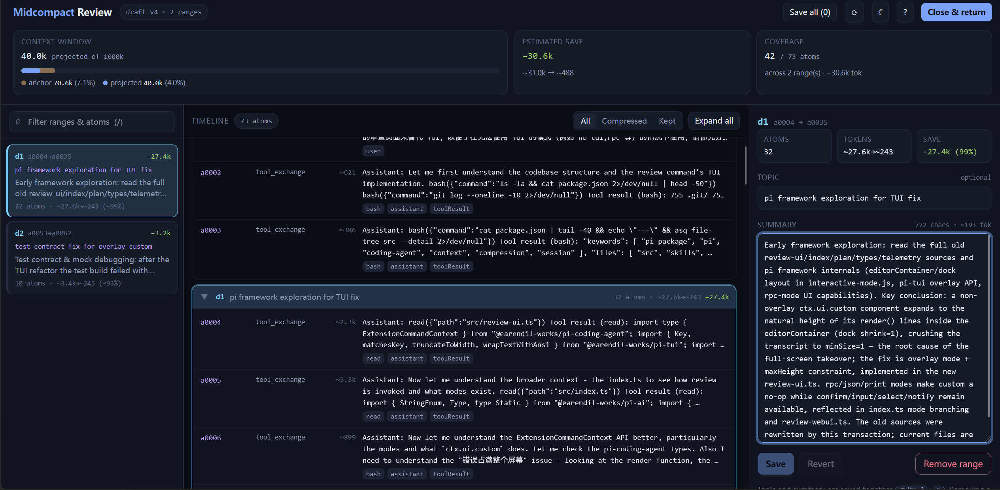
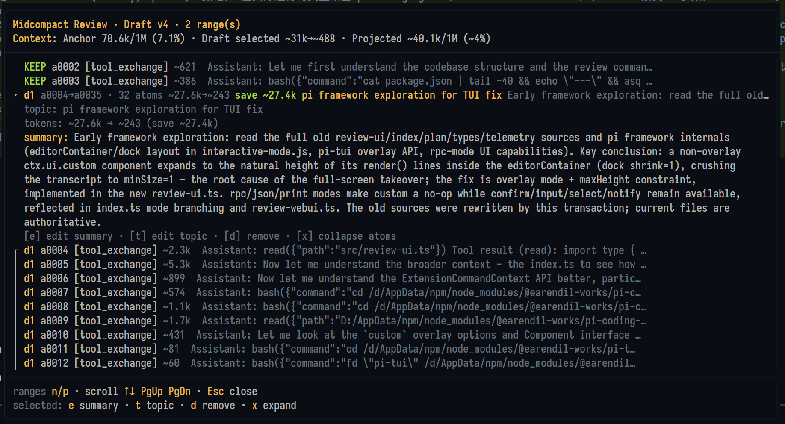

# pi-midcompact

[English](./README.md)

**Attention-aware 的上下文中段压缩：压缩噪声，保留关键信息。**

这里的 Attention-aware 借用注意力机制的核心想法：保留与压缩的判断，要看后续工作仍需关注什么，不能只按消息新旧划分。长会话里的内容不会同时失去价值。早期探索、失败尝试、常规工具输出，以及已经完成的实现过程，在对应工作结束后往往只有很少的后续价值，却可能占据大部分上下文。相比之下，较早的用户需求、关键决策或尚未解决的错误，仍可能需要保留原文。

Pi 内置的 `/compact` 可理解为**前缀压缩**（prefix compaction）：它把一段较早的连续历史汇总为一份摘要，并保留近期上下文。这适合自动维护会话；不过，切分边界本身不会区分可舍弃的早期探索和应保留原文的较早决策。

`pi-midcompact` 名称中的 mid 指向另一种做法：**上下文中段压缩**（mid-context compression）。它在活跃上下文内部选择区段压缩，让两侧仍有价值的内容保留原文，并保留原始会话历史，供需要时召回。

- 可选择多个对话区段进行压缩。
- 区段边界和摘要均须审查后才会生效。
- 原始 Pi 会话条目可在需要时由 Agent 召回。
- 压缩状态只在当前会话树分支生效。

## 它解决什么问题

在合适的工作节点，`pi-midcompact` 会把当前会话叶节点冻结为锚点，并开启独立事务。Agent 负责为已经完成、后续价值较低的阶段拟定压缩区段，关键消息保留原文；草案必须经过审查，只有显式提交后才会生效。

### 用户确定方向，Agent 设计方案

这套流程由 Agent 推动，方向由用户确定。用户只需说明希望保留什么、准备压缩到什么程度；Agent 会查看冻结后的锚点，与用户讨论取舍，拟定待压缩区段和摘要。用户不必自己定位对话原子编号。

> “我只想回收大约 30% 的陈旧上下文，不要压得太狠；早期决策背后的推理请保留原文。”

这里的比例只作规划参考，语义上的重要性高于精确比例。Agent 会把要求转成一份可审查的方案：列出拟压缩区段、明确 `KEEP` 保留区，并为每个区段撰写摘要。用户可以批准、修改或否决，再决定是否提交。

### 在临时分支中规划，提交后选择性投影

`/midcompact start` 会把当前会话叶节点冻结为**锚点**。规划工作发生在临时子分支上，因此用于制定和修改草案的对话不会进入提交后的工作上下文。

```text
冻结锚点：原始会话历史

  [早期探索]────[保留的决策]────[常规工具输出]────[最近工作]  ◀ 锚点
      ╰── d1 ──╯                       ╰── d2 ──╯

规划工作在临时分支上进行：

  ... [最近工作] ──┬── [事务] ── [草案 v1] ── [草案 v2]  ◀ 审查 / 修改
                   │                  （提交时舍弃）
                   └── [midcompact-state]                ◀ 提交后的叶节点
                         （记录已审查的选择；不是模型消息；仅由 /midcompact commit 写入）

后续模型请求看到的是选择性投影后的上下文：

  [d1 摘要]────[保留的决策]────[d2 摘要]────[最近工作]

原始会话 JSONL 仍保留：

  [d1 原文]────[保留的决策]────[d2 原文]────[最近工作]
```

### 实际压缩效果

下面的早期浏览器和 TUI 截图展示了一份包含 **2 个区段**、覆盖 **73 个 atom 中 42 个**的草案，其余 31 个 atom 保留原文。当前 UI 会把 Pi 提供的锚点 usage 与扩展统计的 content chars、图片数量分开显示，不再根据本地字符估算推导预计 token 节省量。点击图片可查看原图。

<p align="center">
  <a href="./figures/review-webui.png">
    
  </a>
  <a href="./figures/review-tui.png">
    
  </a>
</p>

<p align="center"><sub>可编辑的浏览器审查界面 · Pi 原生 TUI 审查界面</sub></p>

### 前缀压缩与上下文中段压缩

两种机制都保留 JSONL 中存储的原始历史，但它们决定后续模型请求内容的方式不同：

```text
Pi 内置 /compact —— 达到阈值时自动执行，或手动执行一次命令

  [较早的一段连续历史────────────────────][保留的近期上下文]
                         │
                         ▼
  [一份压缩摘要──────────────────────────][保留的近期上下文]

pi-midcompact —— 上下文中段压缩，审查后由用户提交

  [陈旧阶段]────[关键决策]────[常规输出]────[近期工作]
      d1             KEEP            d2
       │                               │
       ▼                               ▼
  [d1 摘要]────[关键决策]────[d2 摘要]────[近期工作]
```

| 项目 | Pi `/compact` | `pi-midcompact` |
| --- | --- | --- |
| 开始条件 | 接近上下文上限时自动触发，或运行 `/compact` | 在合适的工作节点运行 `/midcompact start` |
| 选择范围 | 一段较早的连续前缀，并按 token 预算保留近期内容 | 一个或多个经过审查的区段；支持不连续区段和 `KEEP` 保留区 |
| 规划方式 | 支持一次性指令，用于限定生成摘要的重点 | 用户说明范围和保留深度；Agent 讨论取舍并拟定区段与摘要 |
| 提交约束 | 直接生成压缩检查点 | 先形成草案，再用 TUI 或浏览器审查，最后由用户运行 `/midcompact commit` |
| 适用场景 | 自动维护上下文、从上下文溢出中恢复 | 清理已经完成的工作阶段，同时保留特定决策原文 |

`pi-midcompact` 不会关闭或替代 Pi 的自动压缩；它提供另一条经过人工审查的选择性压缩路径。Pi 内置机制可参阅 [Pi 的 compaction 文档](https://github.com/earendil-works/pi-mono/blob/main/packages/coding-agent/docs/compaction.md)。

## 安装

从 npm 安装：

```bash
pi install npm:pi-midcompact
```

从 GitHub 安装：

```bash
pi install git:github.com/frostime/pi-midcompact
```

安装后重启 Pi，或运行 `/reload`。此扩展适用于 Pi `0.84.x`。

## 使用方法

应在合适的工作节点启动事务：当前阶段已完成到足以概括的程度，且 Pi 处于空闲状态。当前节点会成为冻结的**锚点**。Agent 只针对这个快照拟定方案，之后的规划对话不会意外进入被压缩的工作上下文。

### 1. 设置压缩检查点

运行：

```text
/midcompact start
```

Pi 会在创建事务状态前提供三个选项：**Drop**、**Agent direct** 和 **User manual**。Agent direct 进入现有的 inventory-first Agent 流程；User manual 在不触发模型调用的情况下打开 Selection 工作台。用户保存初始 DraftPlan 并关闭界面后，可在准备好时再让 Agent 继续。也可以在命令中直接写明初始重点：

```text
/midcompact start 压缩前期仓库探索过程，但保留用户需求原文。
```

### 2. 与 Agent 讨论压缩方案

直接用自然语言说明目标，例如：

```text
压缩前期仓库探索和常规命令输出。
保留用户需求、被否决的数据库方案，以及最终验证错误的原文。
希望回收约 30% 的陈旧上下文，但不要为了凑精确数字而丢失语义差别。
```

Agent 会在冻结的会话快照中定位相关内容，提出一个或多个区段，并为每个区段撰写摘要。可以要求它保留某条消息、拆分区段，或重写摘要。

### 3. 审查草案

运行：

```text
/midcompact review
```

在交互模式下，原生 TUI 会把冻结的对话显示为线性时间线。每个条目都会标为 `KEEP`，或标明其所属的拟压缩区段。请检查区段边界，以及将用来替换原文的摘要。

在 RPC、print 或其他没有 TUI 的模式下，请改用可编辑的本地浏览器界面：

```text
/midcompact review-webui
```

需要创建或调整区段与 `KEEP` 保留洞时，使用 Selection：

```text
/midcompact select
/midcompact select-webui
```

TUI 与本地浏览器 Review 界面用于编辑摘要/主题和否决区段。Review 不创建或调整区段边界；边界变化应重新打开 Selection。用户先创建计划后，只需发送普通消息要求 Agent 继续当前 midcompact draft，Agent 会先读取已有计划。

### 4. 提交已审查的压缩

方案确认后，运行：

```text
/midcompact commit
```

这个命令只能由用户执行，Agent 无法自行提交压缩。

Pi 会回到锚点，放弃临时规划分支，保存已审查的压缩状态，然后从提交后的分支继续工作。后续模型请求会收到所选旧区段的摘要，而不是原始消息。

### 5. 继续工作或放弃事务

提交后可以继续正常工作。若决定不压缩，运行：

```text
/midcompact abort
```

该命令会回到锚点，丢弃事务，不改变当前生效的上下文。

## 原生 TUI 快捷键

在 `/midcompact review` 中：

```text
n/p 或 Left/Right  选择拟压缩区段
Up/Down、j/k       滚动
PgUp/PgDn          翻页
x                  展开所选区段中的对话原子
e                  编辑所选摘要
t                  编辑所选主题
d                  移除所选区段
Enter/Esc/q        关闭
```

## 命令

| 命令 | 作用 |
| --- | --- |
| `/midcompact start [instructions]` | 显示 Drop / Agent direct / User manual，并在当前会话树叶节点启动事务。 |
| `/midcompact select` | 在原生 TUI 中打开 Selection 工作台，编辑区段和 `KEEP`。 |
| `/midcompact select-webui` | 在本地浏览器中打开 Selection 工作台。 |
| `/midcompact review` | 在原生 TUI 中审查摘要和主题。 |
| `/midcompact review-webui` | 在本地浏览器中审查摘要和主题。 |
| `/midcompact commit` | 提交已审查的草案；只能由用户执行。 |
| `/midcompact abort` | 放弃事务并回到锚点。 |
| `/midcompact status` | 显示当前草案，或本分支已提交的压缩状态。 |

扩展只在事务进行期间在 Pi 页脚显示规划状态；提交或放弃后会自动清除。

## 保证与限制

- **保留原始历史。** 压缩只改变后续模型请求看到的内容，不改写存储的 Pi 消息。
- **匹配失败时保留原文。** 若无法精确定位已审查的消息序列，扩展会原样发送历史，而不会删除不确定的内容。
- **状态只在分支内生效。** 用 `/tree` 回到压缩状态之前的节点会恢复原始历史；回到其后代节点则恢复投影。
- **必须人工审查。** Agent 可以提出方案，不能执行 `/midcompact commit`。
- **保护工具调用协议。** 未知、不完整或孤立的工具调用交互不能压缩。
- **支持重复事务。** 后续事务可以继续压缩新积累的原始上下文；已有摘要保持受保护状态。
- **与 Pi 原生 `/compact` 的组合仍需更多真实会话验证。** 在完成充分验证前，不应在关键工作中依赖两者混用。
- **Provider 与扩展互操作性仍需更多真实会话验证。** 非常规消息形态、第三方上下文转换顺序，以及长时间运行的精确消息指纹尚未得到广泛验证。
- **超长会话尚未完成压力测试。** 审查快照很大、压缩块反复累积时，最终可能需要进一步整合。
- **浏览器工作台仅在本机开放。** `select-webui` 与 `review-webui` 绑定到 loopback，并与原生 TUI 操作同一份分支内 DraftPlan。
